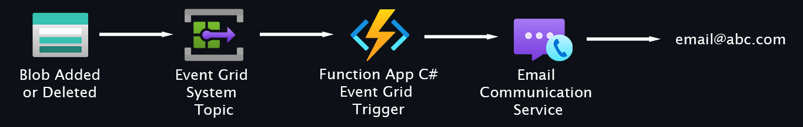

### Upload released-package.zip to container func01

### HTTP Call to Email Communication Service
```powershell
$Token = az account get-access-token --resource "https://communication.azure.com" --query accessToken  --output tsv
$URL = "https://acs-abc-dev-01.europe.communication.azure.com/emails:send?api-version=2023-03-31"
$headers = @{
    "Authorization"            = "Bearer $Token"
    "Content-type"             = "application/json"
    "repeatability-request-id" = [guid]::NewGuid().ToString()
    "repeatability-first-sent" = [DateTime]::UtcNow.ToString("r")
}
$Body = ConvertTo-Json -Depth 4 @{
    senderAddress = "DoNotReply@e059d2b5-37c2-49db-a46f-54a4849e85d2.azurecomm.net"
    recipients    = @{
        to = @(
            @{
                address = "email@abc.com"
            } 
        )
    }
    content       = @{
        subject   = "Azure Communication"
        plainText = "Hello Azure"
    }
}
$I = Invoke-RestMethod -Method POST -URI $URL -Headers $headers -Body $Body
$I
```
### HTTP Call to Function App
```powershell
$URL = "https://func-linux-abc-dev-01.azurewebsites.net/api/Send_Email_For_Testing"
$headers = @{}
$Body = ConvertTo-Json @{
    id          = Get-Random 99999
    eventType   = "Microsoft.Storage.BlobDeleted"
    subject     = "/blobServices/default/containers/sdvsd/blobs/file.tf"
    eventTime   = Get-Date -Format s
    topic       = "/subscriptions/1234abcd-12ab-12ab-95aa-fe7e71802e2e/resourceGroups/rg-egst-abc-dev-01/providers/Microsoft.Storage/storageAccounts/stegst123321dev01"
    data        = @{
        displayName    = "user_test"
        enabled        = "true"
        validationCode = "512d38b6-c7b8-40c8-89fe-f46f9e9622b6"
    }
    dataVersion = "1.0"
}
Invoke-RestMethod -Method POST -URI $URL -Headers $headers -Body $Body
```
### Code
```cs

using Azure.Core;
using Azure.Identity;
using Microsoft.AspNetCore.Http;
using Microsoft.Azure.Functions.Worker;
using Microsoft.Extensions.Logging;
using Newtonsoft.Json;
using System.Text;

namespace EventGrid
{
    public class Function1
    {
        private readonly ILogger<Function1> _logger;
        public Function1(ILogger<Function1> logger)
        {
            _logger = logger;
        }
        [Function("Send_Email")]
        public async Task Run([EventGridTrigger] string cloudEvent)
        {
            _logger.LogWarning("JSON: " + cloudEvent.ToString());

            dynamic? response = JsonConvert.DeserializeObject(cloudEvent);
            string? subject = response?.subject;
            string? eventType = response?.eventType;
            object? data = response?.data;
            string? topic = response?.topic;
            string? id = response?.id;
            string? dataVersion = response?.dataVersion;
            string? metadataVersion = response?.metadataVersion;
            string? eventTime = response?.eventTime;

            _logger.LogWarning("subject: " + subject);
            _logger.LogWarning("eventType: " + eventType);
            _logger.LogWarning("data: " + data);
            _logger.LogWarning("topic: " + topic);
            _logger.LogWarning("id: " + id);
            _logger.LogWarning("dataVersion: " + dataVersion);
            _logger.LogWarning("metadataVersion: " + metadataVersion);
            _logger.LogWarning("eventTime: " + eventTime);

            AccessToken token =
             await new DefaultAzureCredential()
                .GetTokenAsync(
                new TokenRequestContext(
                new[] { "https://communication.azure.com/.default" }));

            string CommunicationSrvUrl = Environment.GetEnvironmentVariable("CommunicationSrvUrl");
            string CommunicationSrvUrlApi = $"{CommunicationSrvUrl}/emails:send?api-version=2023-03-31";
            string DoNotReplyEmail = Environment.GetEnvironmentVariable("DoNotReplyEmail");
            string RecipientEmail = Environment.GetEnvironmentVariable("RecipientEmail");
            _logger.LogWarning("CommunicationSrvUrl: " + CommunicationSrvUrlApi);
            _logger.LogWarning("DoNotReplyEmail: " + DoNotReplyEmail);
            _logger.LogWarning("RecipientEmail: " + RecipientEmail);

            var jsonContent = new StringContent(JsonConvert.SerializeObject(new
            {
                senderAddress = DoNotReplyEmail,
                recipients = new { to = new List<object> { new { address = RecipientEmail } } },
                content = new
                { subject = "Blob modified", plainText = $"FILE: {subject}\nACTION: {eventType}" }

                }), Encoding.UTF8, "application/json");

            System.Net.Http.HttpClient httpClientAzure = new System.Net.Http.HttpClient();
            httpClientAzure.DefaultRequestHeaders.Add("Accept", "application/json");
            httpClientAzure.DefaultRequestHeaders.Add("Authorization", "Bearer " + token.Token);
            httpClientAzure.DefaultRequestHeaders.Add("repeatability-request-id", $"{Guid.NewGuid}");
            httpClientAzure.DefaultRequestHeaders.Add("repeatability-first-sent", $"{DateTime.Now.ToString("yyyy-MM-dd-HH-mm-ss")}");

            var httpResponseMessage = await httpClientAzure.PostAsync(CommunicationSrvUrlApi, jsonContent);
            _logger.LogWarning("IsSuccessStatusCode: " + httpResponseMessage.IsSuccessStatusCode);
        }
        [Function("Send_Email_For_Testing")]
        public async Task RunX([HttpTrigger(AuthorizationLevel.Anonymous, "get", "post")] HttpRequest req)
        {
            string requestBody = await new StreamReader(req.Body).ReadToEndAsync();
            _logger.LogWarning("JSON: " + requestBody);

            dynamic? response = JsonConvert.DeserializeObject(requestBody);
            string? subject = response?.subject;
            string? eventType = response?.eventType;
            object? data = response?.data;
            string? topic = response?.topic;
            string? id = response?.id;
            string? dataVersion = response?.dataVersion;
            string? metadataVersion = response?.metadataVersion;
            string? eventTime = response?.eventTime;

            _logger.LogWarning("subject: " + subject);
            _logger.LogWarning("eventType: " + eventType);
            _logger.LogWarning("data: " + data);
            _logger.LogWarning("topic: " + topic);
            _logger.LogWarning("id: " + id);
            _logger.LogWarning("dataVersion: " + dataVersion);
            _logger.LogWarning("metadataVersion: " + metadataVersion);
            _logger.LogWarning("eventTime: " + eventTime);
        
            AccessToken token =
             await new DefaultAzureCredential()
                .GetTokenAsync(
                new TokenRequestContext(
                new[] { "https://communication.azure.com/.default" }));

            string CommunicationSrvUrl = Environment.GetEnvironmentVariable("CommunicationSrvUrl");
            string CommunicationSrvUrlApi = $"{CommunicationSrvUrl}/emails:send?api-version=2023-03-31";
            string DoNotReplyEmail = Environment.GetEnvironmentVariable("DoNotReplyEmail");
            string RecipientEmail = Environment.GetEnvironmentVariable("RecipientEmail");
            _logger.LogWarning("CommunicationSrvUrl: " + CommunicationSrvUrlApi);
            _logger.LogWarning("DoNotReplyEmail: " + DoNotReplyEmail);
            _logger.LogWarning("RecipientEmail: " + RecipientEmail);
            var jsonContent = new StringContent(JsonConvert.SerializeObject(new
            {
                senderAddress = DoNotReplyEmail,
                recipients = new { to = new List<object> { new { address = RecipientEmail } } },
                content = new
                { subject = "Blob modified", plainText = $"FILE: {subject}\nACTION: {eventType}" }

            }), Encoding.UTF8, "application/json");

            System.Net.Http.HttpClient httpClientAzure = new System.Net.Http.HttpClient();
            httpClientAzure.DefaultRequestHeaders.Add("Accept", "application/json");
            httpClientAzure.DefaultRequestHeaders.Add("Authorization", "Bearer " + token.Token);
            httpClientAzure.DefaultRequestHeaders.Add("repeatability-request-id", $"{Guid.NewGuid}");
            httpClientAzure.DefaultRequestHeaders.Add("repeatability-first-sent", $"{DateTime.Now.ToString("yyyy-MM-dd-HH-mm-ss")}");

            var httpResponseMessage = await httpClientAzure.PostAsync(CommunicationSrvUrlApi, jsonContent);
            _logger.LogWarning("IsSuccessStatusCode: " + httpResponseMessage.IsSuccessStatusCode);
        }
    }
}

```